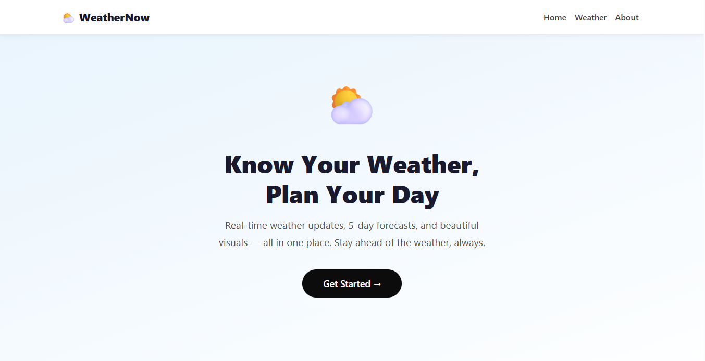
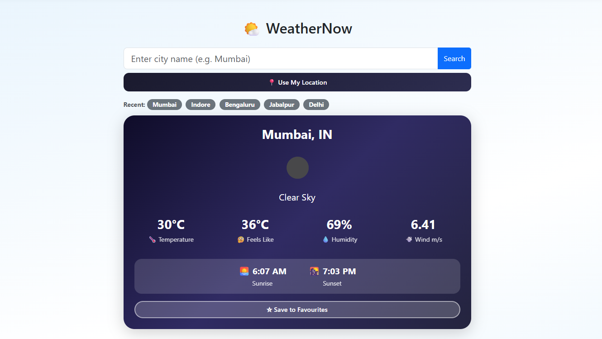
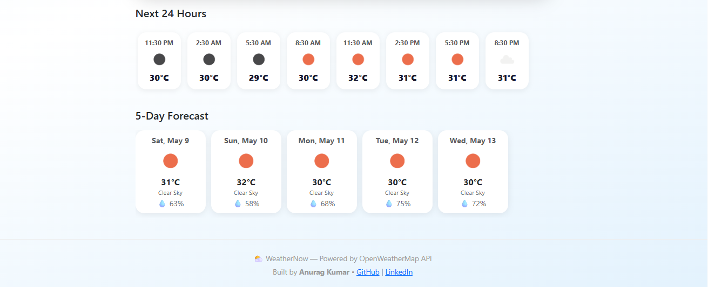

# ⛅ WeatherNow

A full-stack weather application built with **Node.js**, **Express.js**, **Handlebars**, and **MongoDB** — featuring real-time weather data, dynamic themes, and a clean responsive UI.

🌐 **Live Demo:** [weathernow](https://weathernow-7il3.onrender.com/)

---

## Preview

> Search any city and get instant weather with beautiful day/night themes, hourly forecast, and 5-day predictions.

<p align="center">
  
</p>

<p align="center">
  
</p>

<p align="center">
  
</p>

---

## Features

- **Real-Time Weather** — Current temperature, humidity, wind speed for any city worldwide
- **5-Day Forecast** — Daily weather predictions with icons and humidity
- **Hourly Forecast** — Next 24 hours in 3-hour intervals via scrollable strip
- **Dynamic Day & Night Themes** — Background changes based on weather condition and time of day
- **Sunrise & Sunset** — Accurate local times adjusted to the city's timezone
- **GPS Location Detection** — One-click weather for your current location
- **Favourite Cities** — Save and access favourite cities instantly (stored in MongoDB)
- **Search History** — Last 5 unique searches saved automatically to MongoDB
- **Animated Empty State** — Moving clouds and quick city pills before searching
- **Fully Responsive** — Works beautifully on mobile, tablet, and desktop

---

## Tech Stack

| Technology | Purpose |
|---|---|
| **Node.js** | Runtime environment |
| **Express.js** | Web framework & routing |
| **Handlebars** | Server-side templating |
| **MongoDB + Mongoose** | Database for history & favourites |
| **Bootstrap 5** | Responsive UI components |
| **OpenWeatherMap API** | Real-time weather data |
| **dotenv** | Environment variable management |
| **nodemon** | Development auto-restart |

---

## Getting Started

### Prerequisites
- Node.js (v18 or later)
- MongoDB (local or Atlas)
- OpenWeatherMap API key — [get one free here](https://openweathermap.org/api)

### Installation

**1. Clone the repository**
```bash
git clone https://github.com/Anurag-3112/WeatherNow.git
cd WeatherNow
```

**2. Install dependencies**
```bash
npm install
```

**3. Create a `.env` file** in the project root:
```env
WEATHER_API_KEY=your_openweathermap_api_key
MONGODB_URI=your_mongodb_connection_string
```

**4. Start the development server**
```bash
nodemon index.js
```

**5. Open your browser**
```
http://localhost:3000
```

---

## Project Structure

```
WeatherNow/
├── models/
│   ├── Favourite.js        # Mongoose model for favourite cities
│   └── SearchHistory.js    # Mongoose model for search history
├── routes/
│   └── weather.js          # All app routes
├── views/
│   ├── layouts/
│   │   └── main.handlebars # Layout with navbar & footer
│   ├── about.handlebars    # About page
│   ├── home.handlebars     # Landing page
│   └── weather.handlebars  # Weather search
├── static/                 # Static assets
├── .gitignore
├── index.js                # App entry point
├── package.json
└── README.md
```

---

## API Reference

This project uses the **OpenWeatherMap API**:

| Endpoint | Usage |
|---|---|
| `/data/2.5/weather` | Current weather by city name or coordinates |
| `/data/2.5/forecast` | 5-day / hourly forecast |

---

## Dynamic Themes

The weather card background changes automatically based on conditions and time of day:

| Condition | Day Theme | Night Theme |
|---|---|---|
| Clear Sky | Yellow/Orange gradient | Deep purple |
| Clouds | Grey/Blue | Dark navy |
| Rain | Ocean blue | Deep ocean |
| Haze/Mist | Light grey | Dark slate |
| Snow | Ice blue | Dark steel |
| Thunder | Dark blue | Near black |

---

## Responsive Design

- Mobile first approach using Bootstrap 5 grid
- Custom CSS media queries for all screen sizes
- Horizontal scrolling strips for hourly and 5-day forecast on small screens
- Full-width GPS button on mobile

---

## Deployment

This app is deployed on **Render** with **MongoDB Atlas** as the cloud database.

To deploy your own instance:
1. Push code to GitHub
2. Create a [Render](https://render.com) Web Service
3. Add `WEATHER_API_KEY` and `MONGODB_URI` as environment variables
4. Set build command: `npm install`
5. Set start command: `node index.js`

---

## Author

**Anurag Kumar**
- GitHub: [@Anurag-3112](https://github.com/Anurag-3112)
- LinkedIn: [anurag-kumar-work](https://linkedin.com/in/anurag-kumar-work)

---

## License

This project is open source and available under the [MIT License](LICENSE).

---
